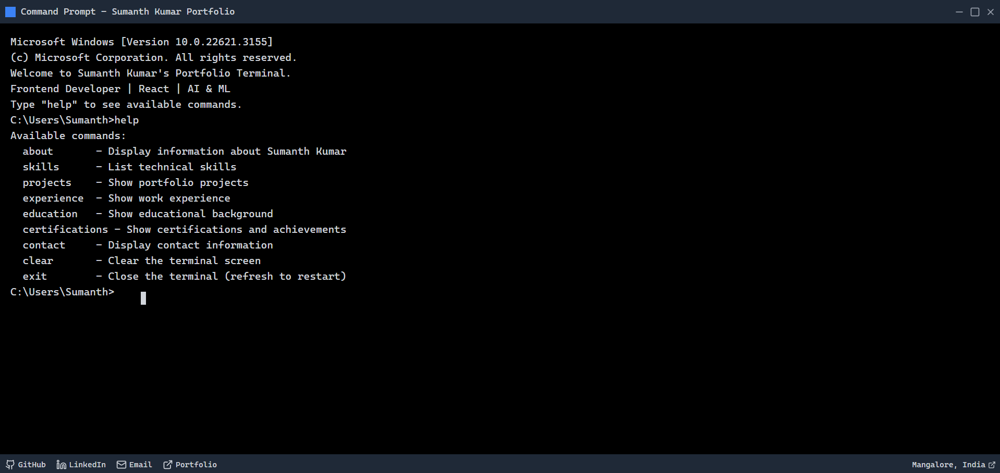

<div align="center">

# `>_` Terminal Portfolio

**A portfolio you explore by typing commands. It looks and feels like a real terminal and works fully in the browser.**

Boot sequence · 30+ commands · fake filesystem · 6 themes · snake · live GitHub feed · works on mobile

[](https://terminal-portfolio-seven-kohl.vercel.app/)
[](https://sumanth-kumar-portfolio.vercel.app/)


<br />



</div>

---

## Contents

- [Try it in 30 seconds](#-try-it-in-30-seconds)
- [Features](#-features)
- [Command reference](#-command-reference)
- [Keyboard shortcuts](#-keyboard-shortcuts)
- [Themes](#-themes)
- [Getting started](#-getting-started)
- [Make it your own](#-make-it-your-own)
- [Project structure](#-project-structure)
- [How it works](#-how-it-works)
- [Privacy](#-privacy)
- [Author](#-author)

---

## ⚡ Try it in 30 seconds

Open the [live demo](https://terminal-portfolio-seven-kohl.vercel.app/) and type:

```text
help            # everything you can do
projects        # featured work, client projects and experiments
project 1       # full case study: product, my role, tech, links
neofetch        # system info, terminal style
theme matrix    # follow the white rabbit
snake           # you know what to do
```

Don't want to type? **Underlined text is clickable**, and on phones there's a quick-command bar above the footer.

---

## ✨ Features

<table>
<tr>
<td width="50%" valign="top">

### 🖥️ Feels like a real terminal
- BIOS-style **boot sequence** on first visit (any key skips)
- CRT scanlines, glow and a blinking block cursor
- **Command history** (↑/↓) and a `history` command
- **Tab autocomplete** for commands, files, themes and projects
- `Ctrl+L` clears, `Ctrl+C` cancels, "did you mean…?" on typos

</td>
<td width="50%" valign="top">

### 📂 A filesystem to explore
- `ls`, `cd projects`, `cat about.txt`, `pwd`
- Every section is also a file; each project is a `.md`
- Windows aliases work too: `dir`, `type`, `cls`
- `cat resume.pdf` does what you'd expect from a binary file

</td>
</tr>
<tr>
<td valign="top">

### 💼 A portfolio inside
- Each project shows **what the product is**, kept separate from **what I did**
- Featured, more and experimental projects in three tiers
- `open <n>` launches a project; `download` fetches the CV
- `hire` opens a pre-filled email
- `github` pulls **live repos** from the GitHub API

</td>
<td valign="top">

### 🎮 Built for fun
- **Snake:** keyboard, swipe or on-screen D-pad; it speeds up as you score and saves your high score
- **Matrix** digital rain, full screen
- `calc`, `joke`, `quote`, `coinflip`, `banner`
- A handful of **hidden easter eggs** 🥚

</td>
</tr>
<tr>
<td valign="top">

### 🎨 Six themes
- CMD, PowerShell, Matrix, Ubuntu, Dracula, Retro Amber
- Switch with `theme <name>` or the 🎨 button
- Your choice is remembered across visits

</td>
<td valign="top">

### 📱 Works everywhere
- Responsive layout, and ASCII art scales to the screen width
- Touch-friendly quick commands and clickable output
- Working title bar: minimize, fullscreen and close
- Multi-stage **exit animation** on `exit`

</td>
</tr>
</table>

---

## 📖 Command reference

| Portfolio | | System | | Fun | |
|---|---|---|---|---|---|
| `about` | Who I am | `help` | All commands | `snake` | Play snake 🐍 |
| `experience` | Work history | `ls` / `dir` | List files | `matrix` | Digital rain |
| `projects` | All projects | `cd <dir>` | Change directory | `calc <expr>` | Calculator |
| `project <n>` | Project case study | `cat` / `type` | Print a file | `joke` | Programmer humor |
| `open <n>` | Open project in new tab | `theme [name]` | Switch theme | `quote` | Dev wisdom |
| `skills` | Expertise & tech stack | `history` | Past commands | `coinflip` | Heads or tails |
| `education` | Education | `neofetch` | System info | `banner` | ASCII banner |
| `certifications` | Certifications | `whoami` / `date` / `uptime` | Session info | | |
| `github` | Live GitHub repos | `echo <text>` | Print text | | |
| `contact` | Get in touch | `clear` / `cls` | Clear screen | | |
| `download` | Download CV | `exit` | Close terminal | | |
| `hire` | Pre-filled email | | | | |

> `project` and `open` accept a number (`project 3`), a slug (`project emenu`) or a name prefix (`open auralion`).
> `open github`, `open linkedin`, `open x` and `open instagram` work too.

<details>
<summary><b>🥚 Easter eggs (spoilers)</b></summary>
<br />

`hi` · `sudo` · `sudo hire-me` · `rm -rf /` · `vim` · `coffee` · `ping`

</details>

---

## ⌨️ Keyboard shortcuts

| Key | Action |
|---|---|
| `↑` / `↓` | Browse command history |
| `Tab` | Autocomplete; press again on multiple matches to list them |
| `Ctrl` + `L` | Clear the screen |
| `Ctrl` + `C` | Cancel the current line |
| Any key | Skip the boot sequence / exit the Matrix |
| `Arrows` / `WASD` | Move in snake (`Space` pauses, `Esc` quits) |

---

## 🎨 Themes

| Theme | Vibe |
|---|---|
| `cmd` | Classic Windows Command Prompt (default) |
| `powershell` | PowerShell blue |
| `matrix` | Green-on-black, follow the white rabbit |
| `ubuntu` | Ubuntu aubergine |
| `dracula` | The popular dark palette |
| `amber` | 1980s amber CRT monitor |

Run `theme next` to cycle through them, or click the palette icon in the title bar.

---

## 🚀 Getting started

**Prerequisites:** Node.js 18+ and npm.

```bash
git clone https://github.com/Skarycloud/terminal-portfolio.git
cd terminal-portfolio
npm install
npm run dev
```

Then open **http://localhost:3000**.

| Script | What it does |
|---|---|
| `npm run dev` | Start the dev server with hot reload |
| `npm run build` | Production build (the page is prerendered as static HTML) |
| `npm run start` | Serve the production build |
| `npm run lint` | Lint the project |

### Deploy

The app builds to a static page, so any Next.js host works. With Vercel, import the repository and keep the default settings. No environment variables are needed.

---

## 🛠️ Make it your own

All the content lives in **one file**, so you can make this terminal yours without touching any UI code.

<details>
<summary><b>Change the text (about, experience, contact…)</b></summary>
<br />

Edit [`lib/portfolio.ts`](lib/portfolio.ts). `profile` holds your name, role, links and resume path. Each section (`aboutLines`, `experienceLines`, …) is a list of lines. Plain strings print normally. Use `out(text, "warning")` to add color. Wrap text in `[[label|command]]` to make it a clickable command. URLs and emails become links automatically.

</details>

<details>
<summary><b>Add a project</b></summary>
<br />

Add an entry to the `projects` array in [`lib/portfolio.ts`](lib/portfolio.ts):

```ts
{
  slug: "my-app",                       // used by `project my-app` and `cat projects/my-app.md`
  name: "My App",
  category: "Next.js · SaaS",
  tier: "featured",                     // "featured" | "more" | "experiment"
  summary: "One line shown in the project list",
  product: ["What the product is."],
  role: "What I did on it.",
  work: ["Things I personally built"],  // optional
  features: ["Product features"],       // optional
  tech: ["Next.js", "Supabase"],
  links: [{ label: "Live", url: "https://example.com" }],
  note: "Optional disclaimer",          // optional
}
```

It appears automatically in `projects`, `ls projects`, tab completion and `open`.

</details>

<details>
<summary><b>Add a theme</b></summary>
<br />

Add an entry to [`lib/themes.ts`](lib/themes.ts) with the ten color tokens (`bg`, `fg`, `prompt`, `accent`, …). It shows up in `theme` and tab completion straight away.

</details>

<details>
<summary><b>Add a command</b></summary>
<br />

In [`app/page.tsx`](app/page.tsx):
1. Add `{ name, desc, group }` to the `COMMANDS` array (this feeds `help` and autocomplete).
2. Add a `case` to the `switch` in `executeCommand` that calls `print([...lines])`.

</details>

<details>
<summary><b>Replace the resume</b></summary>
<br />

Drop your PDF into `public/assets/` and update `profile.resume` and `profile.resumeFile`.

</details>

---

## 🗂️ Project structure

```text
terminal-portfolio/
├── app/
│   ├── page.tsx              # The terminal: commands, rendering, input handling
│   ├── layout.tsx            # Metadata (SEO, Open Graph, X card)
│   └── globals.css           # Cursor blink, CRT and exit animations
├── components/
│   ├── terminal/
│   │   ├── snake-game.tsx    # Canvas snake with keyboard, swipe and D-pad
│   │   └── matrix-rain.tsx   # Full-screen Matrix effect
│   └── ui/                   # shadcn/ui primitives
├── lib/
│   ├── portfolio.ts          # ✏️ All portfolio content lives here
│   └── themes.ts             # Color themes
└── public/assets/            # Resume PDF
```

---

## 🧠 How it works

- **Structured output, not just strings.** Each line in the terminal is typed data (`prompt` or `out`) with a tone (`accent`, `success`, `error`…). A small parser turns `[[label|command]]`, URLs and emails into clickable elements while rendering.
- **Themes are CSS variables.** Each theme sets `--t-bg`, `--t-fg`, `--t-prompt` and the other tokens on the root element, and Tailwind classes such as `text-[var(--t-accent)]` read them. Switching themes means changing one object, with no re-styling.
- **The hidden input does the typing.** A real `<input>` that you can't see captures keystrokes, IME and mobile keyboards. The visible line and block cursor mirror its value and selection.
- **Mode-driven UI.** `boot → terminal → snake | matrix | exiting`. Each mode owns its own rendering and keyboard handling, so games don't fight the prompt for keys.
- **The content is separate from the UI.** The terminal only knows how to print; the content in `lib/portfolio.ts` decides what to print.

---

## 🔒 Privacy

No tracking, analytics or backend. A few small preferences are saved in your own browser:

| Key | Storage | Purpose |
|---|---|---|
| `sk-theme` | localStorage | Your chosen theme |
| `sk-username` | localStorage | Your name, if you say `hi` |
| `sk-snake-best` | localStorage | Your snake high score |
| `sk-booted` | sessionStorage | Skip the boot sequence after the first time |

The only network request is the GitHub API call, and it happens only when you run `github`.

---

## 👨‍💻 Author

<table>
<tr>
<td>

**Sumanth Kumar**: Full-stack Developer & AI Product Builder, Mangalore, India.

I design and build web and mobile products with React, Next.js, React Native and Expo, and I build with AI and agentic systems. I'm currently at **Mirchi35** (two Android apps live on Google Play), founder of **[eMenu](https://emenuweb.com/)** and co-founder of **[Auralion Labs](https://www.auralionlabs.com/)**.

[](https://sumanth-kumar-portfolio.vercel.app/)
[](https://www.linkedin.com/in/sumanth-kumar-230194294)
[](https://github.com/Skarycloud)
[](https://x.com/SumanthKum75525)
[](https://www.instagram.com/skarycloud/)
[](mailto:sumanth.k.0202@gmail.com)

</td>
</tr>
</table>

---

## 📄 License

Released under the [MIT License](LICENSE). Feel free to fork it and make it your own. A link back is appreciated but not required. ⭐ Star the repo if you enjoyed it!

<div align="center">
<br />
<sub>Built with ☕ and too many terminal tabs. Type <code>exit</code> to say goodbye.</sub>
</div>
